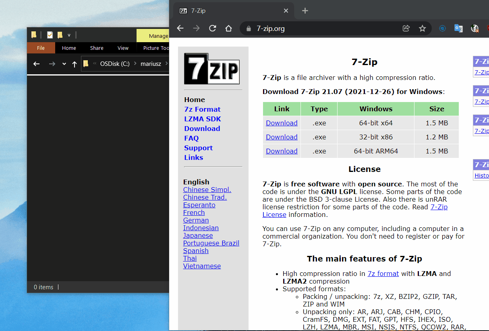
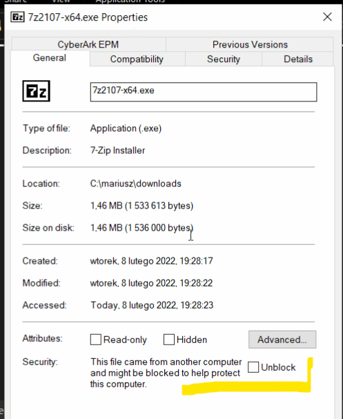
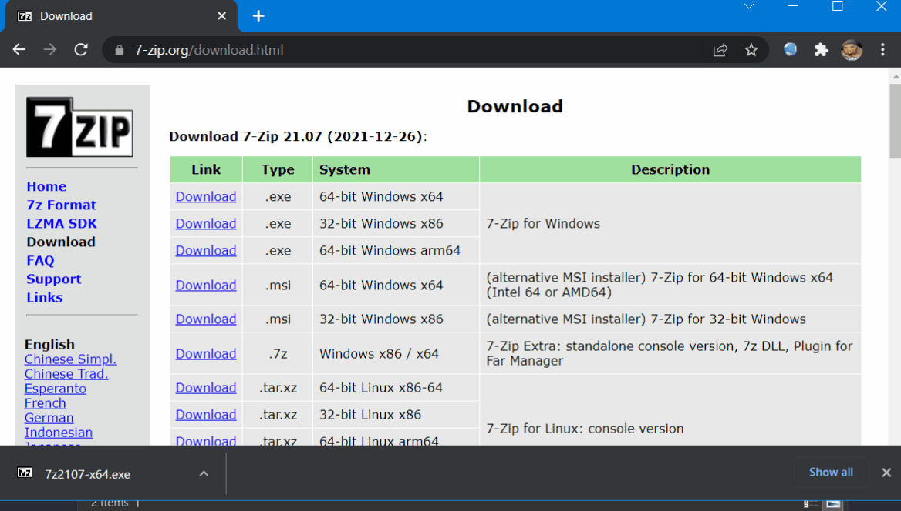
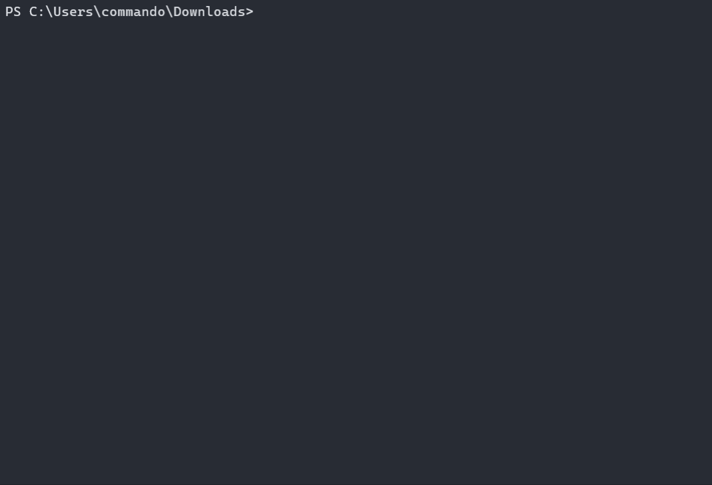

# `PackMyPayload` - Emerging Threat of Containerized Malware

[Jump to supported formats](https://github.com/mgeeky/PackMyPayload#features)

This tool takes a file or directory on input and embeds them into an output file acting as an archive/container. 
It can serve purpose for a Proof-of-Concept presenting emerging risk of container file formats with embedded malware, as well as helper for professional Red Team Operators to sharpen their Initial Access maneuvers.

Currently Threat Actors are known to smuggle their malware archived in various container file formats, to name a few:
- `7zip`
- `zip`
- `ISO`
- `IMG`

They do that to get their payloads pass file content scanners, but more importantly to _avoid having Mark-Of-The-Web flag on their files_. There're various motives on why adversaries don't want MOTW on their files: _Protected View_ in Microsoft Office was always among them.

Should they provide container file to their victims, **a foundation for disabling VBA macros in Internet-originated Office documents** might be bypassed.


## Background

On [Feb, 7th Microsoft announced](https://techcommunity.microsoft.com/t5/microsoft-365-blog/helping-users-stay-safe-blocking-internet-macros-by-default-in/ba-p/3071805) default configuration change to block VBA macros originating from Internet. This is an incredible step towards hardening the baseline configuration of User's workstation and the client software installed within. Arguably overdue, yet an important step dramatically affecting in a positive way typical Windows+Office installation setups.

The implemented behavior is explained to work by differentating macro-enabled Office documents based on the **MOTW** (_Mark of the Web_) flag. That flag acts as a _tainted_ label available for software clients (browsers, mail clients, file archivers, etc) to mark files  originating from untrusted areas like The Internet.

[Outflank shed more light on MOTW](https://outflank.nl/blog/2020/03/30/mark-of-the-web-from-a-red-teams-perspective/), back in 2020 by indicating areas where MOTW flag is not uniformly propagated. These areas serve **_defense gap_** role and are commonly abused by threat actors since years by now.

Their research disclosed, that some _container_ file formats - namely **ISO**, **VHD**/**VHDX** -  do not propagate MOTW taint flag onto inner files upon auto-mount or auto-extraction. Moreover, Windows 8+ is able to open these formats automatically upon double-click, making them _notorius infection carriers, possibly devaluing MOTW in its security measure role_. 


## Demo - How Threat Actors Evade MOTW and Smuggle Macros

Lets present how **Mark of the Web** flag looks like in practice:

### 1. Download a regular file using your Browser



After downloading a file, right click on it and review its properties.

You'll see a message prompting to Unblock the file, because it originates from an untrusted zone.:



That information is stored in NTFS ADS (Alternate Data Stream) named **Zone.Identifier** which looks as follows:


The `ZoneId=3` plays the role of marking file tainted.


### 2. Pack that file into ISO

Using `PackMyPayload.py` emplace the file into an ISO Joliet disk easily with a command:

```
PS> py PackMyPayload.py 7z2107-x64.exe 7z2107-x64.iso
```




### 3. Serve the file with Simple HTTP Server, download, open ISO, review MOTW

Having created ISO file, mimic a HTTP server using Python:
```
PS> py -m http.server 80
```

and then download the ISO file using your Browser. 



When you review Properties of that ISO file, you'll see its marked with MOTW flag.


However, **the inner 7zip installer EXE file is not MOTW-marked!**


---

## Rationale

Using the occassion that Industry's eyes are turned on Microsoft's brave decision to block VBA Macros, we, professional Security Researchers taking the utmost consideration on increasing World's technologies resielience against their misuse, want to add following insight into current Threat Actor TTPs:

**Threat Actors** are well aware of the impact MOTW has on their phishing payloads. They've adapted long time ago and are now smuggling their malicious programs inside of containers. Among the most commonly observed ones we can highlight are `ISO`, `IMG`, `CAB`.

**I am now releasing this tool to increase the momentum built on Microsoft's stand and to help intensify discussions on these evasion avenues**.

It is advised to contain (and/or block) files having above listed extensions whenever they originate from untrusted zones & wherever applicable:

- Web Proxies
- Mail Scanning engines
- Endpoint protection agents - EDRs, XDRs, AVs
- File upload forms & functionalities

The tool released will hopefully enable more Red Teams to simulate discussed risks and help them identify detection gaps within their Partners defenses more easily.


---

## Features

This script offers following treats & goodies:

- Packages input file or directory into output container
- Can backdoor existing containers or create new ones.
- Provides password encryption for supported formats

Formats supported:

| Format | Strips MOTW? | Off the shelf Windows support? | Elevation required? | Remarks                                       |
|--------|--------------|--------------------------------|---------------------|-----------------------------------------------|
| `Zip`  | No           | Yes                            | No                  |                                               |
| `7zip` | Partially    | No                             | No                  | MOTW stripped only on manual files extraction |
| `ISO`  | Yes          | Yes                            | No                  |                                               |
| `IMG`  | Yes          | Yes                            | No                  |                                               |
| `PDF`  | ?            | Yes                            | No                  | Depends on Javascript support in PDF reader   |
| `CAB`  | No           | Yes                            | No                  | Requires few additional clicks on victim-side |
| `VHD`  | Yes          | Yes                            | Yes                 | This script currently can't make directories  |
| `VHDX` | Yes          | Yes                            | Yes                 | This script currently can't make directories  |


## Installation

- Clone this repository
- Install requirements:
```
cmd> pip3 install -r requirements.txt
```


## Sample use

1. Pack a directory with files into ISO:
```
PS> py PackMyPayload.py C:\my\dir malicious.iso -v

+      o     +              o   +      o     +              o
    +             o     +           +             o     +         +
    o  +           +        +           o  +           +          o
-_-^-^-^-^-^-^-^-^-^-^-^-^-^-^-^-^-_-_-_-_-_-_-_,------,      o
   :: PACK MY PAYLOAD (1.1.0)       -_-_-_-_-_-_-|   /\_/\
   for all your container cravings   -_-_-_-_-_-~|__( ^ .^)  +    +
-_-_-_-_-_-_-_-_-_-_-_-_-_-_-_-_-__-_-_-_-_-_-_-''  ''
+      o         o   +       o       +      o         o   +       o
+      o            +      o    ~   Mariusz Banach / mgeeky    o
o      ~     +           ~          <mb [at] binary-offensive.com>
    o           +                         o           +           +

[.] Packaging input file to output .iso (iso)...
Burning files onto ISO:
    Adding file: //malicious.lnk
    Adding file: //malicious.docm
[INFO] [+] File packaged into ISO.
[INFO] Successfully packed input file.

[+] Generated file written to (size: 69632): malicious.iso
```

2. To pack files into VHD/VHDX one must run this script on Windows from an elevated user context (e.g. Local Administrator). This is due to `DISKPART` requiring Admin access to physical devices objects/namespace. Best experience one gets by running the script on `Windows Terminal (wt)` or `ConEmu` as they support ANSI colors. Otherwise, should an output look bad, disable those colors with `-N` flag:
```
PS> py PackMyPayload.py .\evil.lnk .\evil.vhd -v -N

+      o     +              o   +      o     +              o
    +             o     +           +             o     +         +
    o  +           +        +           o  +           +          o
-_-^-^-^-^-^-^-^-^-^-^-^-^-^-^-^-^-_-_-_-_-_-_-_,------,      o
   :: PACK MY PAYLOAD (1.1.0)       -_-_-_-_-_-_-|   /\_/\
   for all your container cravings   -_-_-_-_-_-~|__( ^ .^)  +    +
-_-_-_-_-_-_-_-_-_-_-_-_-_-_-_-_-__-_-_-_-_-_-_-''  ''
+      o         o   +       o       +      o         o   +       o
+      o            +      o    ~   Mariusz Banach / mgeeky    o
o      ~     +           ~          <mb [at] binary-offensive.com>
    o           +                         o           +           +

[.] Packaging input file to output .vhd (vhd)...
[INFO] Drive letters currently occupied:
    X
    C
    Z
    D
[INFO] Will create VHD of size:    1024MB (Dynamic)
[INFO] Will assign VHD letter :    V:
[INFO] Will format VHD with   :    FAT32
[INFO] Creating VHD file...
[+] Created & mounted VHD file on V:\
[.] Packing files into created VHD...
[INFO] Packaged file:
[INFO]     evil.lnk => V:\
[.] Detaching VHD file...
[+] Detached VHD file from V:\
[INFO] [+] File packaged into VHD.
[INFO] Successfully packed input file.

[+] Generated file written to (size: 6311936): evil.vhd
```


---

## Full usage

```
usage:
+      o     +              o   +      o     +              o
    +             o     +           +             o     +         +
    o  +           +        +           o  +           +          o
-_-^-^-^-^-^-^-^-^-^-^-^-^-^-^-^-^-_-_-_-_-_-_-_,------,      o
   :: PACK MY PAYLOAD (1.1.0)       -_-_-_-_-_-_-|   /\_/\
   for all your container cravings   -_-_-_-_-_-~|__( ^ .^)  +    +
-_-_-_-_-_-_-_-_-_-_-_-_-_-_-_-_-__-_-_-_-_-_-_-''  ''
+      o         o   +       o       +      o         o   +       o
+      o            +      o    ~   Mariusz Banach / mgeeky    o
o      ~     +           ~          <mb [at] binary-offensive.com>
    o           +                         o           +           +

Usage: ./package.py [options] <infile> <outfile>

options:
  -h, --help            show this help message and exit

Required arguments:
  infile                Input file/directory to be packaged into output archive/container
  outfile               Output file with extension pointing at output format

Options:
  -v, --verbose         Verbose mode.
  -d, --debug           Debug mode.
  -N, --nocolor         Dont use colors in text output.
  -i BACKDOOR, --backdoor BACKDOOR
                        Instead of generating blank new output container/archive, will backdoor existing input one.
  -n NAME, --filename NAME
                        Package input file into archive/container under this filename (may contain relative path).
  -p PASSWORD, --password PASSWORD
                        If output archive/container format supports password protection, use this password to protect
                        output file.
  --out-format {zip,7z,iso,img,cab,pdf,vhd,vhdx}
                        Explicitely define output format disregarding output file's extension. Can be one of
                        following: zip, 7z, iso, img, cab, pdf, vhd, vhdx
  --hide HIDE           Set hidden attribute on file(s) in ISO

VHD specific options:
  --vhd-size SIZE       VHD dynamic size in MB. Default: 1024
  --vhd-letter LETTER   Drive letter where to mount VHD drive. Default: will pick unused one at random.
  --vhd-filesystem FS   Filesystem to be used while formatting VHD. Default: FAT32. Supported: fat, fat32, ntfs

=====================================================

Supported container/archive formats:

        - zip
        - 7z
        - iso
        - img
        - cab
        - pdf
        - vhd
        - vhdx

=====================================================
```

---

## Known Issues

- Can't create directories while copying files onto VHD/VHDX mounted volumes.


---

## TODO

- Add support for `MSI` files

- Embed files into MS Office 2007+ documents: `word` -> `embeddings` -> `oleObject1.bin` (OLE stream) + adjust 

- Consider adding support to other egzotic archive formats (not really coping with MOTW or supported off the shelve by Windows):
  - `tar`
  - `cpio`
  - `pax`
  - `xar`
  - `ar`
  - `mtree`
  - `shar`
  - `tar`
  - `cpgz`
  - `uu`
  - `lha`

- **WinZip Pro** also supports extraction of following formats - maybe worth adding them too:
  - `B64`, `BHX`, `BZ`, `BZ2`, `GZ`, `HQX`, `LHA`, `LZH`, `MIM`, `TAZ`, `TBZ`, 
  - `TBZ2`, `TGZ`, `TXZ`, `TZ`, `UU`, `UUE`, `VMDK`, `XXE`, `XZ`, `Z`, `ZIPX`, 

---

## Trivia

I kindly ask you to read following line out loud and as fast as you can in front of a mirror:

```
py Pack My Payload dot py
```

Some say the spell summons ancient DAEMON and Sheeps `( ͡~ ͜ʖ ͡°)`

---

## Contributors

Round of applause & thank you to the following contributors who helped enhance this tool:

- @ChoiSG ([@_choisec](https://twitter.com/_choisec)) - added `--hide` flag for hiding file(s) in ISO/IMG containers


---

### ☕ Show Support ☕

This and other projects are outcome of sleepless nights and **plenty of hard work**. If you like what I do and appreciate that I always give back to the community,
[Consider buying me a coffee](https://github.com/sponsors/mgeeky) _(or better a beer)_ just to say thank you! 💪 

---

```
Mariusz Banach / mgeeky, (@mariuszbit)
<mb [at] binary-offensive.com>
```
